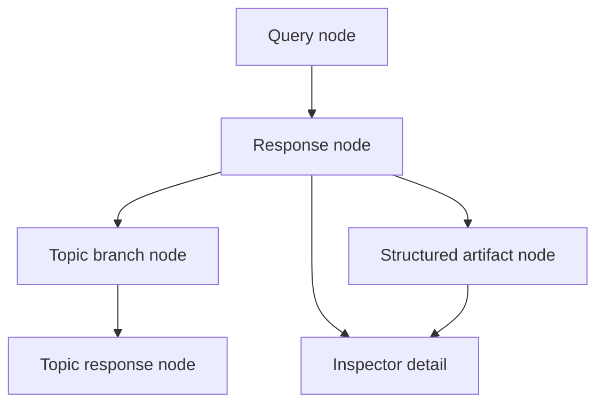
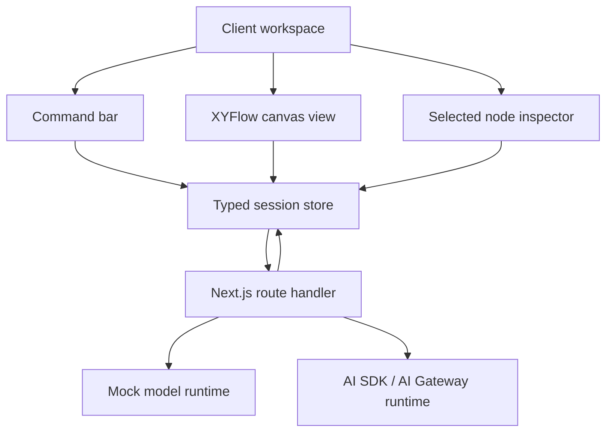
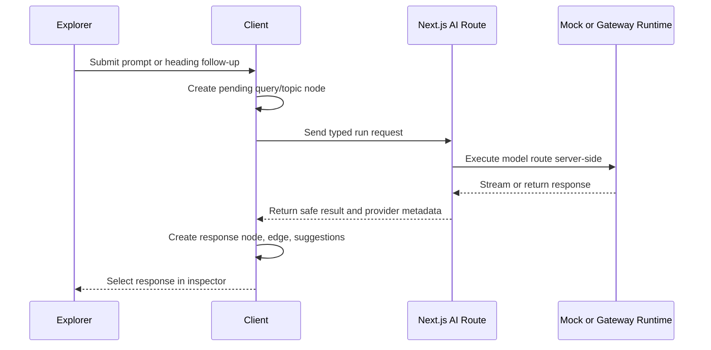
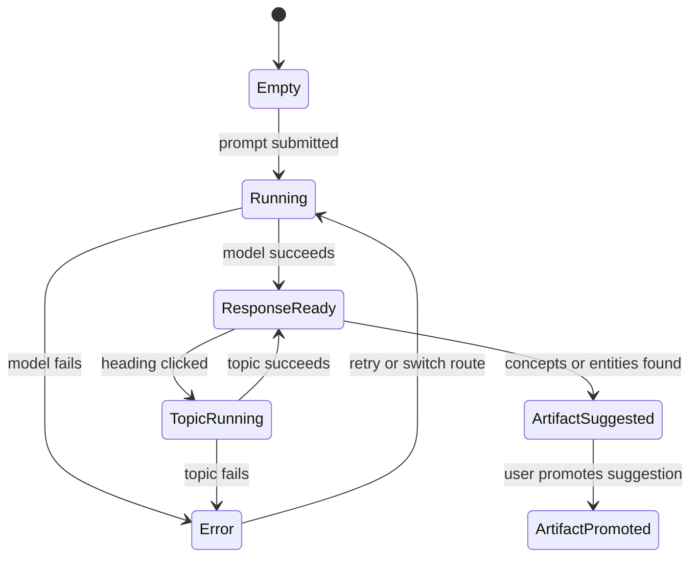

# Wabbit AI Exploration Workspace Rebuild - Plan

## Goal Capsule

- **Objective:** Rebuild Wabbit as a secure AI exploration workspace that preserves the current prompt, response, heading follow-up, model selection, and markdown behavior while replacing the fragile client-side architecture with a cleaner product foundation.
- **Product authority:** The current app behavior in `README.md`, verified source files under `src/`, and the existing feature audit workbook at `outputs/2026-06-21-feature-audit/llm-chatbot-feature-status.xlsx`.
- **Execution profile:** Code.
- **Open blockers:** Live provider health is not currently a reliable acceptance signal until OpenRouter model availability and the Gemini account state are rechecked with healthy credentials.
- **Tail ownership:** LFG owns implementation, simplification, review follow-up, browser verification, commit/PR handling when allowed by repo state, and CI watch when a PR exists.
- **Planning constraints:** Provider secrets must not be bundled into browser code, and dependency modernization must be intentional rather than incidental churn.

---

## Product Contract

### Summary

Wabbit should become an AI exploration workspace where prompts, model responses, heading follow-ups, and structured artifacts form an inspectable exploration graph.
The implementation replaces the Vite client-only app with a Next.js App Router app, keeps provider execution behind server route handlers, and uses typed session state as the source of truth for both the canvas and inspector.

### Problem Frame

The current app is a React, TypeScript, and Vite chatbot UI for OpenRouter and Gemini with model selection, Gemini settings, response cards, markdown rendering, and clickable headings for follow-up exploration.
That behavior is valuable, but the existing implementation hides the exploration structure inside carousel state and response metadata.

The provider boundary is the largest security problem.
The current client reads provider keys from `VITE_OPENROUTER_API_KEY` and `VITE_GEMINI_API_KEY`, and the browser-side components instantiate provider clients from those values.

The codebase also carries documentation and dependency drift.
`technical-docs.md` still describes React 18, Vite 6, and TypeScript 5.4, while `package.json` declares React 19, Vite 8, and TypeScript 6.
A read-only `npm outdated --json` check on 2026-07-01 also showed patch or minor drift across Radix UI packages, Tailwind tooling, Axios, ESLint, Prettier, `lucide-react`, and Vite.

### Key Decisions

- **Preserve behavior before expanding scope.** The rebuild must make the current user stories measurable before adding larger workspace behavior.
- **Make the hidden graph explicit.** Existing topic metadata already links a heading follow-up to a parent response, so the rebuild should promote that relationship into the main session model instead of treating it as carousel-only history.
- **Move AI execution server-side.** Browser code must call product-owned server APIs, not OpenRouter or Gemini directly with `VITE_*` provider secrets.
- **Use a canvas plus inspector shape.** The canvas should carry exploration structure, while the inspector should carry readable response detail, JSON parts, model route state, and errors.
- **Target a modern AI app stack.** Next.js App Router, React, AI SDK, AI Gateway or OpenRouter-compatible routing, typed JSON rendering, and a controlled node canvas are the stack direction, with exact versions and API shapes validated during planning.
- **Defer model comparison as a v1 product feature.** The rebuild needs model selection and run provenance first; comparison nodes can come after parity and graph basics work.
- **Product Contract preservation:** Product Contract unchanged; planning adds implementation contracts and assumptions without changing R-IDs, flows, acceptance examples, or scope boundaries.

### Actors

- A1. **Explorer:** The person using Wabbit to ask prompts, read model output, follow generated topics, and preserve useful exploration artifacts.
- A2. **AI runtime:** The server-side product boundary that validates requests, routes model runs, streams results, records metadata, and returns provider errors safely.
- A3. **Planning and QA agent:** The downstream agent or human who uses the feature audit workbook and this Product Contract to turn current behavior into implementation units and verification cases.

### Requirements

**Current behavior parity**

- R1. The rebuild must support prompt submission through a command/input surface, including disabled-state handling, empty-query guards, loading state, and current-query tracking.
- R2. Each model result must preserve the current response contract: original query, response content, model identifier, timestamp, and metadata.
- R3. Response rendering must preserve markdown normalization, safe HTML handling, code-copy behavior, and clickable headings.
- R4. A clicked heading must create a follow-up topic response linked to its parent response, including topic metadata and error metadata when generation fails.
- R5. Model selection must preserve OpenRouter and Gemini provider grouping, Gemini-specific generation settings, and visible model provenance on each result.
- R6. Recommended prompt behavior must be retained or intentionally replaced with a better first-run prompt affordance during planning.
- R7. The existing carousel/card history may be replaced, but users must retain a clear way to navigate previous prompts, responses, topic branches, and loading/error states.

**Exploration workspace**

- R8. A session must represent the exploration as typed nodes and edges, starting with query nodes, response nodes, topic branch nodes, and structured artifact nodes.
- R9. Edges must reflect why one node exists, such as a prompt producing a response or a heading click producing a topic branch.
- R10. Selecting a node must open an inspector with the readable response, source query, model route, timestamp, structured parts, and any provider or validation errors.
- R11. Structured artifacts must render as typed UI cards rather than raw JSON dumps, with concepts and entities as the first supported artifact types.
- R12. Artifact promotion must be user-controlled when model output suggests extractable structure, so the canvas does not fill with low-value generated nodes.
- R13. The workspace must support a chronological trail or equivalent history view alongside the graph so linear reading remains possible.

**AI runtime and security**

- R14. Provider API keys must be held only on the server side and must not use browser-exposed `VITE_*` provider-key variables.
- R15. The browser must receive streamed or completed AI results through product-owned server APIs with typed request and response contracts.
- R16. Provider errors must be visible enough for recovery while avoiding secret leakage, raw credential disclosure, or confusing generic failure states.
- R17. The runtime must distinguish deterministic mock/test runs from live provider calls so QA can pass without depending on provider availability.
- R18. The default model and model registry must be refreshed so launch behavior does not rely on unavailable, suspended, or stale provider models.
- R19. The product must record model route, provider, status, latency or duration when available, and retry/fallback outcome for each run.

**Architecture and maintainability**

- R20. UI components must depend on product/application contracts rather than concrete provider SDK clients.
- R21. The graph/session model must be typed independently from the rendering library so canvas implementation details do not own product state.
- R22. The JSON rendering layer must handle typed AI output parts and artifact cards, not arbitrary unvalidated object rendering.
- R23. The new stack must remove or replace outdated code paths where they conflict with the secure server-side AI boundary.
- R24. Documentation must be updated as part of the overhaul so stack, setup, environment variables, provider routing, verification, and known limitations match the rebuilt app.
- R25. Dependency updates must be explicit planning work, not incidental churn; package changes should be grouped by risk and verified against the rebuilt stack.

**Audit and verification**

- R26. The existing canonical feature-status workbook remains the current status source until its user stories are migrated or superseded by the enriched plan.
- R27. Each preserved behavior must map to a user story with expected behavior, current status, and verification evidence.
- R28. Testing must cover deterministic mock behavior, provider error handling, graph creation, topic branching, structured artifact rendering, and secret-boundary regressions.

### Key Flows

- F1. **Prompt to response**
  - **Trigger:** The explorer submits a prompt from the command/input surface.
  - **Actors:** A1, A2.
  - **Steps:** The app validates the prompt, sends a server-side model run, streams or returns the response, creates a query node, creates a response node, links them, and selects the response in the inspector.
  - **Outcome:** The explorer can read the response, see model provenance, and branch from generated headings.
  - **Covered by:** R1, R2, R5, R8, R10, R14, R15, R19.

- F2. **Heading follow-up**
  - **Trigger:** The explorer clicks a rendered heading inside a response.
  - **Actors:** A1, A2.
  - **Steps:** The app treats the heading as a topic, submits a topic-specific model run with parent context, creates a topic branch node, creates the topic response node, and links both to the parent response.
  - **Outcome:** The topic follow-up is visible as a branch, not only as the next carousel item.
  - **Covered by:** R3, R4, R7, R8, R9, R13.

- F3. **Structured artifact promotion**
  - **Trigger:** A response contains model-suggested concepts or entities.
  - **Actors:** A1, A2.
  - **Steps:** The inspector shows suggested artifact cards, the explorer promotes useful items, and the app adds typed artifact nodes linked to the source response.
  - **Outcome:** The graph captures reusable structure without automatically accepting every extraction.
  - **Covered by:** R10, R11, R12, R22.

- F4. **Provider failure recovery**
  - **Trigger:** A model run fails because credentials, provider account state, rate limits, model availability, or validation fail.
  - **Actors:** A1, A2.
  - **Steps:** The runtime records a safe error state, the UI shows the affected node and recovery options, and deterministic tests remain independent of the provider outage.
  - **Outcome:** The explorer understands what failed and QA can distinguish product regressions from provider conditions.
  - **Covered by:** R16, R17, R18, R19, R28.

### Acceptance Examples

- AE1. **Covers R1, R2, R8, R10.** Given an explorer submits a non-empty prompt while the app is enabled, when the server run succeeds, then the session contains a query node linked to a response node and the inspector shows the response content, model route, and timestamp.
- AE2. **Covers R3, R4, R9.** Given a response renders headings, when the explorer clicks a heading, then a topic branch is created with a parent link to the source response and the topic response appears as a child branch.
- AE3. **Covers R11, R12, R22.** Given a response includes suggested concepts or entities, when the explorer promotes one suggestion, then a typed artifact node is created and linked to the source response without promoting the remaining suggestions.
- AE4. **Covers R14, R15, R16.** Given the browser bundle is inspected after production build, then provider API keys are absent from client code and AI calls flow through product-owned server APIs.
- AE5. **Covers R16, R17, R28.** Given a provider returns a live error, when the run fails, then the UI shows a safe error state and deterministic mock tests can still pass without live provider access.
- AE6. **Covers R23, R24, R25.** Given the overhaul updates the stack, when documentation and verification are reviewed, then setup instructions, environment variables, package expectations, and test commands match the rebuilt app.

### Success Criteria

- Current Wabbit behaviors are traceable from the feature audit workbook to requirements, flows, and tests.
- Provider secrets are no longer browser-exposed.
- The graph model is the product source of truth for query, response, topic branch, and artifact relationships.
- The UI supports both spatial exploration and readable response inspection.
- Documentation no longer contradicts the installed or targeted stack.
- Dependency modernization is intentional, reviewed, and verified rather than mixed into unrelated refactors.

### Scope Boundaries

- Continuous discovery habits, product-management workflows, and persona-specific discovery tools are outside this rebuild.
- Freeform canvas authoring is deferred until the existing AI exploration loop works through typed graph nodes.
- Model comparison nodes are deferred until model selection, provenance, and provider reliability are stable.
- Public multi-tenant collaboration, team accounts, sharing permissions, and billing are outside v1 unless explicitly added later.
- Exact database choice, route shapes, component hierarchy, and package upgrade batches belong to planning, not this requirements-only Product Contract.

### Dependencies / Assumptions

- The canonical spreadsheet at `outputs/2026-06-21-feature-audit/llm-chatbot-feature-status.xlsx` remains available for current user story status.
- Live provider acceptance depends on healthy OpenRouter and Gemini credentials plus available launch models.
- The target stack should be validated against current official documentation during planning before implementation locks exact package versions.
- The rebuild can start as a single-user/private workspace; public multi-user security requirements require a separate product decision.

### Outstanding Questions

- **Deferred to follow-up work:** Add durable multi-device persistence after single-user local sessions prove the graph model.
- **Deferred to follow-up work:** Add explicit model comparison nodes after model selection, provenance, and provider reliability are stable.
- **Deferred to follow-up work:** Revisit public collaboration, sharing permissions, accounts, and billing only after this private-workspace rebuild ships.

### Sources / Research

- `README.md:3` describes the current product feature set.
- `README.md:18` points to the canonical feature-status workbook.
- `package.json:6` through `package.json:11` define current verification commands.
- `package.json:13` through `package.json:53` show the declared dependency stack.
- `technical-docs.md:11` through `technical-docs.md:20` show documentation drift against current package declarations.
- `src/components/QueryInput.tsx:34` through `src/components/QueryInput.tsx:86` define prompt submission, provider lookup, response creation, and error response behavior.
- `src/components/MarkdownMessage.tsx:24` through `src/components/MarkdownMessage.tsx:80` define markdown rendering and heading click handling.
- `src/lib/topicHandler.ts:27` through `src/lib/topicHandler.ts:81` define topic follow-up generation and parent metadata.
- `src/interfaces/core.ts:9` through `src/interfaces/core.ts:25` define the current response data contract.
- `src/lib/providerConfig.ts:1` through `src/lib/providerConfig.ts:18` show current browser-exposed provider-key lookup.
- `src/lib/models.ts:21` through `src/lib/models.ts:71` define the current provider/model registry.
- `src/components/ResponseList.tsx:52` through `src/components/ResponseList.tsx:145` show current carousel rendering of responses and loading states.
- `src/components/ChatResponseCard.tsx:93` through `src/components/ChatResponseCard.tsx:135` show current card, model provenance, and markdown response rendering.

---

## Planning Contract

### Key Technical Decisions

- KTD1. **Next.js App Router owns runtime boundaries.** Route handlers provide server-side AI endpoints and keep provider credentials in `process.env`, while interactive UI surfaces remain client components.
- KTD2. **AI SDK UI messages are the streaming contract.** The server route should use AI SDK streaming primitives when a live gateway route is configured, and the browser should consume typed message parts rather than parsing arbitrary provider responses.
- KTD3. **Local session persistence is v1 storage.** The first rebuild persists exploration sessions in browser storage behind a typed adapter, avoiding database, auth, and account scope that the Product Contract excludes.
- KTD4. **The graph model is independent of XYFlow.** Product state uses Wabbit-owned query, response, topic, artifact, and edge types; XYFlow nodes and edges are derived view models.
- KTD5. **Structured artifacts are typed and promotable.** Concepts and entities are suggested from response content and only become graph nodes after user action.
- KTD6. **Mock runtime is a first-class execution mode.** Deterministic responses must exercise the same route and state contracts as live runs so tests do not depend on external provider availability.
- KTD7. **Documentation and dependencies move with the stack migration.** Vite-specific entrypoints, scripts, and setup text should be removed or rewritten as part of the migration rather than left as stale parallel paths.
- KTD8. **The AI route is private-workspace scoped.** v1 assumes local or protected deployment, validates request size and route IDs, and avoids logging prompt text or provider credentials; public unauthenticated deployment needs a later auth/rate-limit decision.

### Assumptions

- A1. The v1 rebuild can use local browser persistence because the Product Contract excludes public collaboration, team accounts, and multi-device sharing.
- A2. AI Gateway is the preferred live runtime route when `AI_GATEWAY_API_KEY` is present; explicit OpenRouter/Gemini compatibility can sit behind the same server contract if gateway is unavailable.
- A3. The app can keep the existing visual identity and shadcn/Radix-style primitives while replacing layout and state architecture.
- A4. Package updates required for Next.js, AI SDK, and XYFlow are authorized by the requested LFG execution of this overhaul, but no global installs or production provider calls are required.
- A5. The shipped v1 is not a public multi-tenant SaaS surface; if deployed publicly, it must sit behind Vercel deployment protection or an equivalent access control until auth is planned.

### High-Level Technical Design

### Implementation Constraints

- Keep all new plan and code references repo-relative.
- Do not call live provider APIs during verification unless a test is explicitly marked live and credentials are healthy.
- Do not leak server-only environment variable values into client bundles, logs, screenshots, or generated docs.
- Keep package churn tied to the migration; do not opportunistically update unrelated libraries unless the new stack requires it.
- Prefer characterization tests around existing markdown, topic, and provider behavior before deleting the old Vite paths.

### System-Wide Impact

- Build and development commands change from Vite to Next.js.
- Environment variable names change from browser-exposed `VITE_*` provider keys to server-only runtime keys.
- The current response array becomes a richer session graph, so every UI surface must read from the same typed store.
- Documentation and the canonical feature audit need to describe the new stack and verification gates.

### Risks & Dependencies

- **Provider drift:** OpenRouter, Gemini, and AI Gateway model availability can change; tests must distinguish live provider outages from product failures.
- **Streaming complexity:** UI message streaming can complicate graph creation; the implementation may land completed-result behavior first if streaming blocks parity, but the route contract must still be compatible with streams.
- **Canvas accessibility:** XYFlow gives node interactions, panning, and zooming, but keyboard navigation and inspector affordances must be verified instead of assumed.
- **Migration blast radius:** Replacing Vite with Next.js touches package scripts, entrypoints, CSS loading, routing, and tests in one PR.

### Sources & Research

- Next.js documentation confirms App Router route handlers provide server API endpoints and client components are required for interactive hooks and browser UI.
- AI SDK documentation confirms `streamText`, UI message streams, `useChat`, and message `parts` are the current contract for streamed chat UIs.
- Vercel AI Gateway documentation confirms AI SDK can route by provider/model strings, can use `@ai-sdk/gateway`, and exposes provider attempt metadata for fallback/error handling.
- XYFlow documentation confirms controlled `nodes` and `edges`, custom `nodeTypes`, pan/zoom controls, and node/edge/selection event handlers.
- `scripts/verify-user-stories.mjs` provides deterministic precedent for mock provider verification.

---

## Implementation Units

### U1. Convert the app shell from Vite to Next.js

- **Goal:** Replace Vite entrypoints with a Next.js App Router shell that renders the Wabbit workspace as the first screen.
- **Requirements:** R1, R7, R14, R23, R24, R25, AE4, AE6.
- **Dependencies:** None.
- **Files:** `package.json`, `package-lock.json`, `app/layout.tsx`, `app/page.tsx`, `app/globals.css`, `next.config.ts`, `tsconfig.json`, `eslint.config.js`, `README.md`, `technical-docs.md`, `index.html`, `src/main.tsx`, `src/App.tsx`, `vite.config.js`, `tsconfig.node.json`.
- **Approach:** Add Next.js and required AI/canvas dependencies, move the app entry to `app/`, import the existing global CSS through `app/globals.css`, and remove or retire Vite-only entrypoints and scripts.
- **Execution note:** Treat this as a stack migration; run compile and lint checks after the shell renders before changing behavior-heavy code.
- **Patterns to follow:** Preserve the current Tailwind and component utility style from `src/index.css` and `src/components/ui/*`.
- **Test scenarios:**
  - The Next.js dev/build entry renders the workspace page without importing Vite-only globals.
  - The build output does not include `VITE_OPENROUTER_API_KEY` or `VITE_GEMINI_API_KEY` references.
  - Documentation setup commands name Next.js scripts and server-only environment variables.
- **Verification:** The app builds under Next.js, the root page renders, stale Vite scripts are absent, and docs no longer describe the active app as a Vite runtime.

### U2. Define the exploration domain model and local persistence adapter

- **Goal:** Introduce typed session, node, edge, model route, run status, provider state, and artifact types that become the app source of truth.
- **Requirements:** R2, R4, R8, R9, R10, R11, R12, R13, R19, R21, R26, R27, AE1, AE2, AE3.
- **Dependencies:** U1.
- **Files:** `src/domain/exploration.ts`, `src/domain/exploration.test.ts`, `src/lib/explorationStore.ts`, `src/lib/explorationStore.test.ts`, `src/interfaces/core.ts`, `scripts/verify-user-stories.mjs`.
- **Approach:** Keep the existing response shape as a compatibility boundary, add graph-native types around it, and persist sessions through a small adapter that can later be replaced by database storage.
- **Technical design:** Directionally, every model run creates or updates a `query` or `topic` node, creates a `response` or `error` node, and records an edge with a semantic reason such as `generated` or `branched-from`.
- **Patterns to follow:** Mirror the centralized type style in `src/interfaces/core.ts` and the deterministic checks in `scripts/verify-user-stories.mjs`.
- **Test scenarios:**
  - Covers AE1. A prompt run creates a query node, response node, and generated edge with model route metadata.
  - Covers AE2. A heading follow-up creates a topic node with parent linkage and a child response edge.
  - Covers AE3. Promoting one suggested entity creates one artifact node while leaving other suggestions unpromoted.
  - Loading a saved session restores selected node, nodes, edges, responses, and artifact suggestions.
- **Verification:** Domain tests prove graph creation and persistence behavior without rendering React.

### U3. Implement the server-side AI runtime boundary

- **Goal:** Replace browser-side provider SDK calls with Next.js route handlers that run mock or live model routes on the server.
- **Requirements:** R14, R15, R16, R17, R18, R19, R20, R28, AE4, AE5.
- **Dependencies:** U1, U2.
- **Files:** `app/api/ai/run/route.ts`, `src/server/ai/runRequest.ts`, `src/server/ai/modelRoutes.ts`, `src/server/ai/mockRuntime.ts`, `src/server/ai/gatewayRuntime.ts`, `src/server/ai/providerErrors.ts`, `src/server/ai/runRequest.test.ts`, `src/api/openRouter.ts`, `src/api/gemini.ts`, `src/lib/providerConfig.ts`, `.env.example`, `scripts/verify-user-stories.mjs`.
- **Approach:** Create a typed run request for prompt and topic modes, validate route input, choose mock runtime when requested, use AI SDK or gateway routing for live runs when configured, and normalize provider errors before they reach the client.
- **Security constraints:** Enforce bounded prompt/context sizes, reject unknown route IDs, never log raw prompt text or provider credentials, and document that public unauthenticated deployment is outside v1.
- **Technical design:** The route accepts product-level run intent, not raw provider request bodies; provider-specific details stay inside server runtime modules.
- **Patterns to follow:** Preserve error-card behavior from `src/components/QueryInput.tsx` and `src/lib/topicHandler.ts`, but move provider construction out of React components.
- **Test scenarios:**
  - Covers AE4. Client-importable modules cannot access server provider keys or provider SDK clients.
  - Covers AE5. Mock mode returns deterministic content and route metadata without live credentials.
  - A missing or invalid live route returns a safe error payload with no credential value.
  - Oversized prompts and unknown route IDs are rejected before any provider call.
  - Runtime logs do not include raw prompt text or provider credential values.
  - A topic request includes parent query context and records topic metadata.
- **Verification:** Server runtime tests prove mock success, validation errors, provider error normalization, and secret boundary behavior.

### U4. Build the workspace state hook and command flow

- **Goal:** Replace the chat context reducer with an exploration workspace state layer that drives command submission, topic runs, artifact promotion, selection, and history.
- **Requirements:** R1, R2, R4, R6, R7, R8, R9, R10, R12, R13, R17, R19, AE1, AE2, AE3, AE5.
- **Dependencies:** U2, U3.
- **Files:** `src/hooks/useExplorationWorkspace.ts`, `src/hooks/useExplorationWorkspace.test.ts`, `src/components/WorkspaceShell.tsx`, `src/components/CommandBar.tsx`, `src/components/SessionTrail.tsx`, `src/components/ChatContextProvider.tsx`, `src/components/QueryInput.tsx`, `src/components/InputArea.tsx`.
- **Approach:** Centralize workspace mutations in a hook/reducer, replace direct provider calls with route calls, keep recommended prompts as a command-bar affordance, and derive history from graph state.
- **Patterns to follow:** Carry forward reducer discipline from `src/components/ChatContextProvider.tsx` while removing concrete provider dependencies from components.
- **Test scenarios:**
  - Empty input does not create nodes or call the server route.
  - A successful prompt creates pending state, response state, selected node, and history entry.
  - A failed run creates an error node and safe inspector state.
  - A recommended prompt submits through the same path as typed input.
  - A heading follow-up dispatches a topic run with parent context.
- **Verification:** Hook tests prove state transitions independent of canvas rendering.

### U5. Build the canvas and inspector UI

- **Goal:** Render the exploration graph as the primary workspace with selectable typed nodes, a chronological trail, and an inspector for response details.
- **Requirements:** R3, R7, R8, R9, R10, R11, R12, R13, R21, R22, AE1, AE2, AE3.
- **Dependencies:** U2, U4.
- **Files:** `src/components/canvas/ExplorationCanvas.tsx`, `src/components/canvas/ExplorationNode.tsx`, `src/components/canvas/graphAdapter.ts`, `src/components/canvas/graphAdapter.test.ts`, `src/components/InspectorPanel.tsx`, `src/components/ArtifactCard.tsx`, `src/components/MarkdownMessage.tsx`, `src/components/markdown/EnhancedMarkdown.tsx`, `src/components/ResponseList.tsx`, `src/components/CardCarousel.tsx`, `src/components/ChatResponseCard.tsx`.
- **Approach:** Use XYFlow as a controlled rendering layer, derive canvas nodes and edges from domain state, and keep selected-node detail in an inspector rather than embedding full responses in graph nodes.
- **Technical design:** The adapter maps product nodes to compact canvas nodes with type-specific badges and maps product edges to display edges; selected IDs flow back into the workspace state.
- **Patterns to follow:** Preserve markdown normalization and clickable-heading behavior from `src/components/MarkdownMessage.tsx`.
- **Test scenarios:**
  - Graph adapter produces stable XYFlow nodes and edges for query, response, topic, artifact, and error nodes.
  - Selecting a response node shows markdown, source query, model route, timestamp, and safe errors in the inspector.
  - Clicking a markdown heading in the inspector creates a topic run through the workspace hook.
  - Promoting a concept or entity suggestion creates a visible artifact node and card.
  - Empty sessions show the command-first workspace without layout overlap on desktop and mobile widths.
- **Verification:** Component and adapter tests prove graph rendering inputs, inspector selection, heading actions, and artifact promotion behavior.

### U6. Refresh model selection and provider configuration

- **Goal:** Replace stale provider/model configuration with server-safe model routes and UI selection that reports route status and provenance.
- **Requirements:** R5, R14, R16, R18, R19, R20, R24, R25, AE5, AE6.
- **Dependencies:** U3, U4.
- **Files:** `src/lib/models.ts`, `src/components/ModelSelector.tsx`, `src/components/ModelControls.tsx`, `src/server/ai/modelRoutes.ts`, `.env.example`, `README.md`, `technical-docs.md`, `scripts/verify-user-stories.mjs`.
- **Approach:** Store public model display metadata separately from server runtime configuration, default to a mock-safe route in local verification, and require live routes to be configured by server-only environment variables.
- **Patterns to follow:** Keep the current provider grouping UX from `src/components/ModelSelector.tsx` but remove text that asks users to expose `VITE_*` provider keys.
- **Test scenarios:**
  - Model selector lists supported public routes and marks unavailable routes without crashing.
  - Gemini settings remain available only where the selected route supports them.
  - Route metadata appears on response and error nodes.
  - Documentation names server-only environment variables and mock mode.
- **Verification:** Registry tests prove defaults, provider grouping, route support flags, and docs consistency.

### U7. Modernize verification, docs, and audit traceability

- **Goal:** Update the deterministic user-story verifier, documentation, and audit references so the overhaul can be tested without provider access.
- **Requirements:** R24, R26, R27, R28, AE4, AE5, AE6.
- **Dependencies:** U1, U2, U3, U4, U5, U6.
- **Files:** `scripts/verify-user-stories.mjs`, `README.md`, `technical-docs.md`, `outputs/2026-06-21-feature-audit/llm-chatbot-feature-status.xlsx.inspect.ndjson`, `package.json`, `package-lock.json`.
- **Approach:** Extend the existing verifier to cover graph creation, topic branching, artifact promotion, server runtime mock mode, and secret-boundary checks; update docs to explain the rebuilt architecture and known live-provider limitations.
- **Patterns to follow:** Preserve the workbook as the canonical status source until a later migration explicitly replaces it.
- **Test scenarios:**
  - The verifier passes with mock AI runtime and no live provider keys.
  - The verifier fails if client code imports server AI runtime modules.
  - The verifier covers prompt response, heading branch, artifact promotion, and provider error states.
  - Docs and package scripts agree on the active stack and commands.
- **Verification:** `npm run verify:user-stories`, type checking, linting, build, and browser QA all pass against the rebuilt app.

---

## Verification Contract

| Gate | Applies to | Done signal |
|---|---|---|
| `npm run verify:user-stories` | U2, U3, U4, U5, U6, U7 | Deterministic feature/user-story checks pass without live provider keys. |
| `npm run lint` | All units | ESLint reports zero warnings or errors for app, server, and scripts. |
| `npx tsc --noEmit --noUnusedLocals true --noUnusedParameters true` | All units | TypeScript accepts the Next.js app and testable modules with strict unused checks. |
| `npm run build` | U1, U3, U5, U6, U7 | Production build succeeds and does not expose provider secrets in client output. |
| Browser verification | U1, U4, U5, U6 | The root workspace renders, accepts a mock prompt, shows graph nodes, opens inspector detail, follows a heading, promotes an artifact, and remains usable at desktop and mobile widths. |
| Secret-boundary audit | U1, U3, U6, U7 | Searches of client-delivered code and client-importable modules show no server provider key access. |
| Route abuse-control audit | U3, U7 | Invalid routes, oversized prompts, and missing live configuration fail safely before provider calls. |

Live provider smoke checks are optional and must be reported separately from product correctness because known provider/account failures can make them fail even when the app is correct.

---

## Definition of Done

- The plan file remains `artifact_readiness: implementation-ready`, `execution: code`, and contains no launch-blocking open question.
- All U1-U7 implementation units are completed or explicitly revised in this plan before execution continues.
- The rebuilt app runs as a Next.js App Router app with no Vite runtime dependency.
- Provider execution is server-side, with deterministic mock mode available for verification.
- Query, response, topic branch, structured artifact, and error states are represented in a typed graph session model.
- The workspace UI exposes a canvas, chronological trail, command surface, inspector, model route state, markdown rendering, heading follow-up, and artifact promotion.
- Documentation, environment examples, and package scripts match the rebuilt stack.
- Verification Contract gates pass, except optional live provider smoke checks may be reported as external-provider failures.
- Abandoned migration code, unused Vite entrypoints, and dead provider-client paths are removed from the active app.
